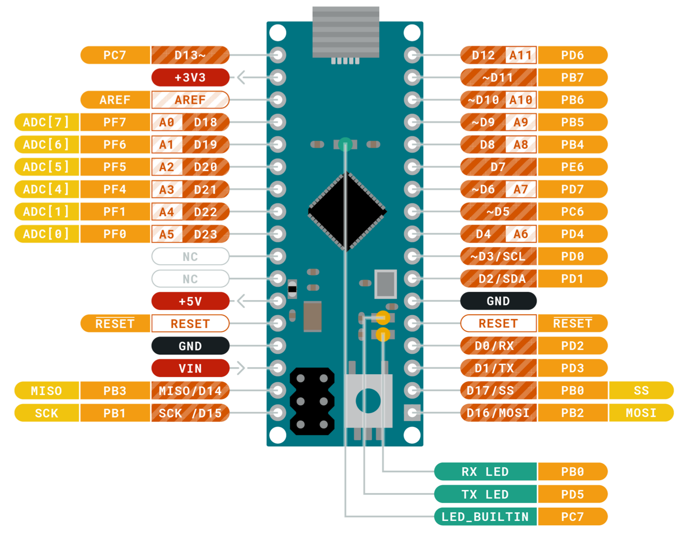
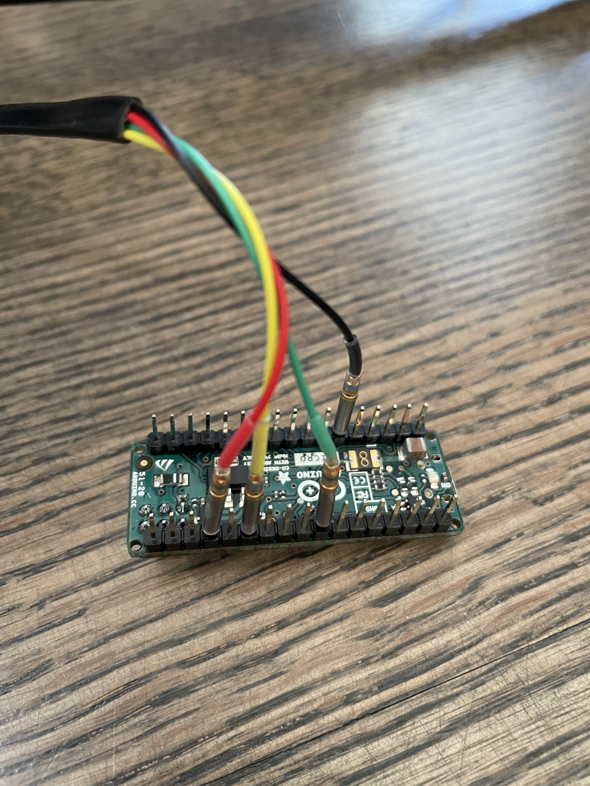
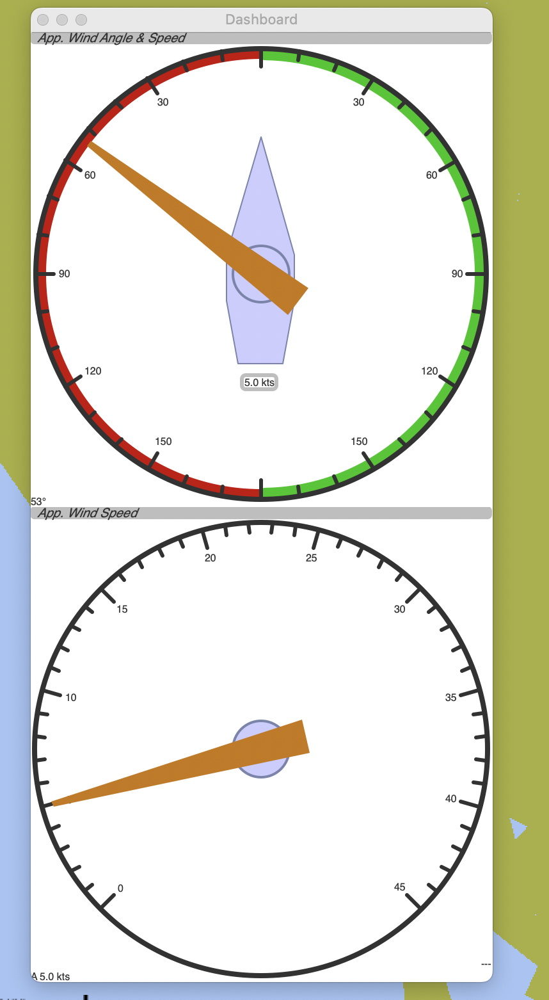

# Davis Instruments Standard Anemometer - NMEA0183 via Arduino

## WARNING - This is hobby project. I have not tested the accuracy of the output yet.

This projects turns your Davis Anemometer to a NMEA0183 marine instrument.

This project uses an [Arduino Micro](https://store.arduino.cc/usa/arduino-micro) to read the analog wind speed and 
direction data from a [Davis Instruments Standard Anemometer](https://www.davisinstruments.com/product/anemometer-for-weather-monitor-or-wizard/).
The Arduino Micro outputs NMEA 0183 MWV sentences 4Hz on its serial port (4500baud).

| Wired | Arduino Micro Pins |
| ----------- | ----------- |
|       |        |
| Wired Closeup   | OpenCPN Screenshot |
|  |  |

## Range
Wind Speed 1 to 173 knots
Wind Direction  0° to 360° or 16 compass points

## Resolution
Wind Speed 0.5 kt
Wind Direction 1° (0° to 355°), 22.5° between compass points

## Measurement Timing
Wind Speed Sample Period .25 seconds
Wind Speed Sample and Display Interval. 4 seconds
Wind Direction Sample Interval .25 second
Wind Direction Display Update Interval .25 seconds